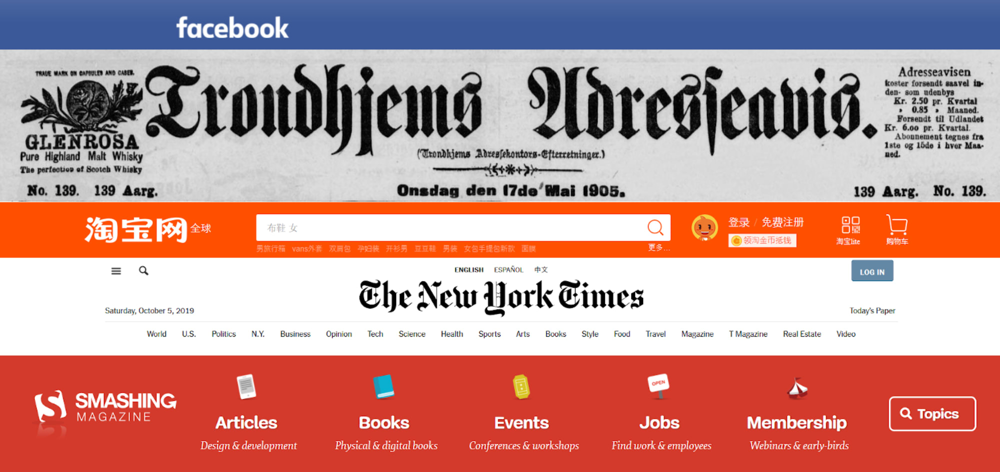

# Nameplate

## Context
Every newspaper has a nameplate. It’s just about the only thing you can guarantee won’t change from edition to edition. It’s the bit at the top of the front page, and comprises of the publication’s name and logo.

A lot of these are iconic in their own right. The nameplates of publications like The Washington Post and The Sun are seared into the public consciousness. Nameplates are the branding, the bit that says, ‘We’re not that other newspaper. We’re this newspaper.’ It communicates who you are and what you’re about.

Practically every website has a nameplate, only on websites we call it the header.  It’s weird for a website not to have one, and for it not to appear on every page. In news and web design the underlying purpose of the nameplate is the same: **get the brand front and centre and guide users to something they’ll care about**.

## Problem Statement

Create the headers which resembles the given images below that helps in branding and guiding users to the important sections of the pages.  

### Tasks

Following tasks need to be completed to build the solution for this practice:​
- Task 1 :: Create Nameplate – 1​
- Task 2 :: Create Nameplate – 2​
Use CSS float property to align the nameplate elements. ​​

### Task1: Nameplate 1

- The HTML code for nameplate-1 is available in nameplate1-style.html file.​
- The style code for nameplate-1 should be provided in nameplate1.css file.​
- The output for the nameplate-1 should be as shown below:

### Task1: Nameplate 2

- The HTML code for nameplate-2 is available in nameplate2-style.html file.​
- The style code for nameplate-2 should be provided in nameplate2.css file.​
- The output for the nameplate-2 should be as shown below:

